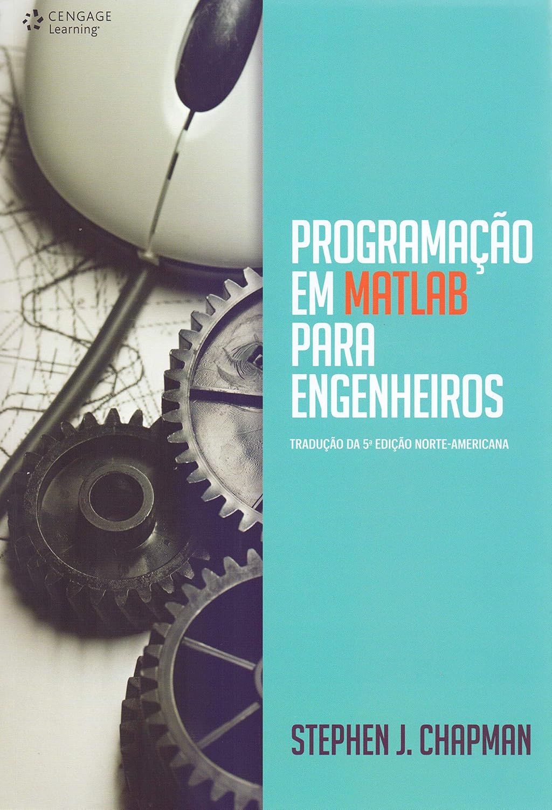

# Livro Programacao em Matlab para Engenheiros

Repositório de códigos para leitura do livro Programacao em Matlab para Engenheiros, de [Stephen J. Chapman](https://www.amazon.com.br/Programa%C3%A7%C3%A3o-em-matlab-para-engenheiros/dp/8522125228/ref=pd_sbs_d_sccl_1_1/145-5119286-0297651?pd_rd_w=PeOR5&content-id=amzn1.sym.53b2f13e-ab3a-40f2-aab9-7e4b988d3762&pf_rd_p=53b2f13e-ab3a-40f2-aab9-7e4b988d3762&pf_rd_r=TDA6YW7RHKGH7ZAKNBFW&pd_rd_wg=a09PI&pd_rd_r=74c6df71-c4bb-4790-ad5f-1924e84a7d18&pd_rd_i=8522125228&psc=1), tradução da 5ª edição norte-americana.

